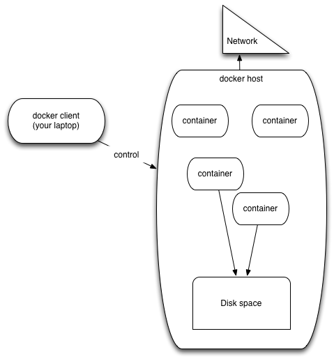
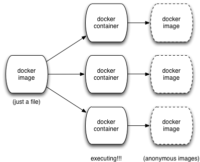

A brief introduction to Docker, Jupyter, and mybinder.org
=========================================================

See also:

* `January 2016 workshop at Berkeley <https://github.com/ngs-docs/2016-bids-docker/blob/master/README.md>`__

* `Blog post on transcriptome analysis with Docker <http://ivory.idyll.org/blog/2015-transcriptomes-with-docker.html>`__

Getting started: can you run 'hello, world'?
--------------------------------------------

Start up docker and run::

   docker run hello-world

What do you get?

(You might need to do ``docker-machine restart default``.)

----

A brief introduction to Docker in two images.

First image: docker components.

Second image: from images to running containers.

Running Docker on EC2
---------------------

Configure your AWS access credentials (see Etherpad)::

   export AWS_KEY=
   export AWS_SECRET=
   export VPC_ID=

Then, run::
  
  docker-machine create --driver amazonec2 --amazonec2-access-key ${AWS_KEY} \
        --amazonec2-secret-key ${AWS_SECRET} --amazonec2-vpc-id ${VPC_ID} \
        --amazonec2-zone b --amazonec2-instance-type m3.xlarge \
        aws

and to connect Docker to it, do::

  eval $(docker-machine env aws)

and now you can run all the 'docker' commands as you would expect, EXCEPT
that your docker host is now running Somewhere Else (on EC2).

So, for example::

  docker run -it hello-world

is now running on your EC2 instance.

Running transrate
-----------------

`transrate <http://hibberdlab.com/transrate/>`__ is a program that
evaluates transcriptomes.  It's not terribly difficult to install,
but it's moderately annoying.  Let's not bother, eh?

::

   docker run -it diblab/transrate /bin/bash

(Key bit of info: this is fetching stuff over the network to your AWS
machine, not your local machine!)

This will put you in a command prompt on your Docker container, which
has transrate (and all its dependencies) already installed.

Now execute::

  cd /home
  curl -L https://s3.amazonaws.com/public.ged.msu.edu/nema-subset.tar.gz | \
     tar xzf - nema.fa

This is a transcriptome (from another tutorial ;).

Now, run transrate::

  transrate --assembly nema.fa

...cool, eh? All we needed was Docker and the name of the container to run
(and some data).

Building your own transrate image
---------------------------------

Go to some convenient directory on your local machine, and run::

  git clone https://github.com/ctb/2015-docker-building.git
  cd 2015-docker-building/transrate
  cat Dockerfile

These are instructions for building a Docker image to run the transrate
software yourself.  Try::
  
  docker build -t my_transrate .

and then wait a while.  Once it's done, run::
  
  docker run -it my_transrate /bin/bash

and repeat the above::

  cd /home
  curl -L https://s3.amazonaws.com/public.ged.msu.edu/nema-subset.tar.gz |\
     tar xzf - nema.fa
  transrate --assembly nema.fa

So, that's how you *build* a Docker image.  (You `can look at the
Dockerfile in a Web browser, if you like
<https://github.com/ctb/2015-docker-building/blob/master/transrate/Dockerfile>`__)

Why is this useful?  If you are in either of the following situations,

* You have a specific set of software you need to work together, and that
  may not work well with other software.
  
* You have software that's hard to install and/or requires a lot of
  dependencies.

then Docker provides a way to deliver a nice package of software all
working together.

An Apparent Digression: Project Jupyter, a quick demo
=====================================================

`Jupyter <http://jupyter.org/>`__ (the new name for IPython Notebook)
is pretty awesome.

With a notebook server, you can:

* run data analyses interactively from a remote machine in Python 2, Python 3,
  and a host of other languages (including R);
* save everything as a notebook, or a Python script;
* get a full text editor on the remote machine;
* upload files to the remote machine;
* get a terminal window on the remote machine.

...the only problem with Jupyter is that it's got a lot of dependencies
and can be hard to install.

This is kind of the situation that Docker is built for -- so, what
about running it inside a Docker container?

Running Jupyter inside a Docker container on your docker host
=============================================================

It's pretty easy to get a docker container running with Jupyter in it;
just do::
   
    docker run -it jupyter/notebook

..but how do we connect?  The key thing here is that we need to connect
to a Web site running on a *different computer* -- the docker host.

So, run in the background ('-d') with a port mapping::

   JUP=$(docker run -d -p 8000:8888 jupyter/notebook)

and then run this to get the URL to connect to::
  
   echo http://$(docker-machine ip aws):8000

If you go to that URL with a Web browser, you should see a Jupyter notebook.

To stop it, do::

   docker stop $JUP

Putting it all together: mybinder.org
=====================================

http://mybinder.org/ is a site that creates Docker containers,
downloads github repositories into them, and then runs Jupyter
Notebook servers in them.

A basic example: the inflammation data set.

* `mybinder view <http://mybinder.org/repo/ctb/2016-mybinder-inflammation>`__
* `github repository source <https://github.com/ctb/2016-mybinder-inflammation>`__

A more complex example: installing stuff with a Docker file

* `mybinder view <http://mybinder.org/repo/ctb/2016-mybinder-irkernel>`__
* `github repository source <https://github.com/ctb/2016-mybinder-irkernel>`__

This combines **a description of a compute environment** (the Dockerfile)
running in a (Docker) container with an **interactive Web site for
running data analyses** (Jupyter Notebook).
